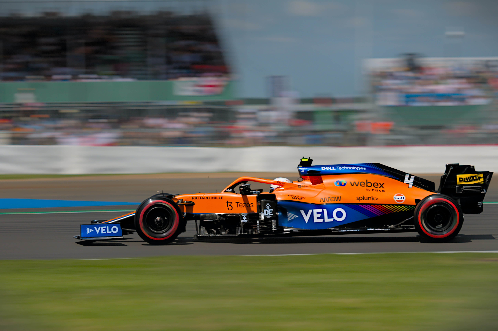
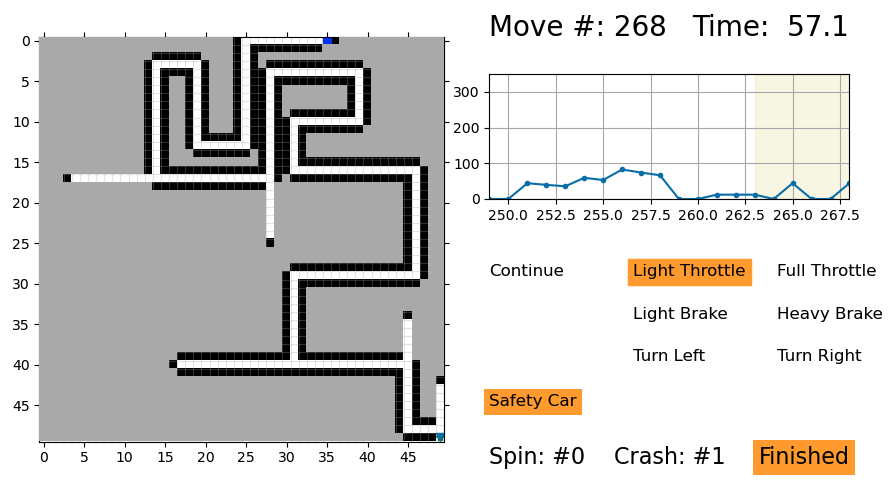
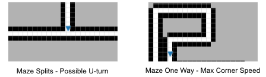
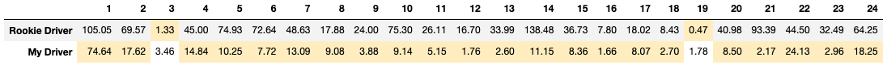
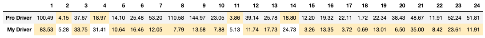
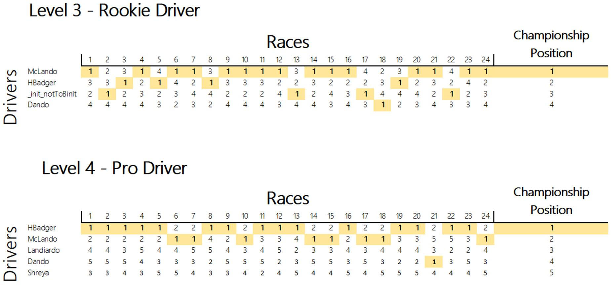

# Optimizing The McLaren Maze Race



In 2021, as a part of the [McLaren Substitute Teacher series](https://www.mclaren.com/racing/partners/dell-technologies/mclaren-substitute-teacher/), the McLaren F1 team released a contest to see who can create an AI that can navigate a maze by learning to drive a car ([Series 2, Lesson 1](https://www.mclaren.com/racing/partners/dell-technologies/mclaren-substitute-teacher-maze-race/)).  The AI learner is primarily trained through reinforcement learning and learns only by the feedback of its actions in the maze environment.  The contest provides several accompanying Jupyter notebooks walking through how the process works in their [GitHub repo](https://github.com/mclaren-maze-race/mclaren-maze-race).  I highly recommend giving the notebooks a read / run through, they are well produced and does not assume the reader needs prior knowledge of machine learning.

In the Maze Race contest, there are several factors to take into account in order to build a fast AI driver.  On the Rookie Driver level there is learning the controls of the car, how to use previous tracks to learn future tracks, and what speed to limit the car to avoid crashes and penalties.  On the Pro Driver level there is also predicting grip from the tires and accounting for rain and weather.  The example code gives 24 maze tracks to practice on.  When submitting to the contest, the AI driver code is run on 24 unseen tracks and different car characteristics to prevent memorization from the sample environment.



My approach to the contest environment was to look for optimizations that would result in achieving a better overall result than the AI drivers given in the example code.  Given there are many tracks the contest will run, a better overall performance is preferred over the performance on a particular track.  A good optimization would balance reducing the overall time to complete all tracks without overstepping the limit and suffering time penalties.  Additionally, making small revisions at a time and recording the result is helpful in the optimization process.  Lastly, running a revision several times with different random seeds shows how robust the revision is.  The example drivers were pretty good at learning how to drive so I decided to look for optimizing elsewhere.

## Rookie Driver Level

The first optimization I made was with cornering speed.  I saw that there was a surprising speed difference between the speed the car can go through a corner vs making a u-turn without crashing.  The former being higher than the latter.  The example driver learned a single speed for both situations (which was the u-turn speed, the minimum of the two).  So separating learning a safe corner speed from a u-turn speed resulted in a better overall time.  Since the maze only has dead ends when the driver has to choose between going left or right, the u-turn speed is applied when we are not sure if we will hit a u-turn and the corner speed is used otherwise.  This gained about a 10% speed advantage on all tracks.



However, after turning on safety car penalties I found this advantage was much smaller.  What was the problem?   Turns out carrying a higher speed overall incurs more safety car penalties.  The penalty for a safety car violation is a cumulative 1 second per infraction during a race.  There are fine margins that separate race times and even a few penalties would be the difference between winning and losing.  To manage safety car penalties I applied methods for effectively getting under the safety car speed (I found more ways to optimize this later on).

Against the sample rookie AI driver, here is how my driver stacked up (lower is better):



## Pro Driver Level

On the Pro Driver level there were additional factors around predicting the grip of the car.  The same optimizations in the Rookie Driver level resulted in a smaller time difference over the example driver.  On this level it seems that there are a lot of different factors to optimize to create a better driver so I turned to Hyperopt to discover how to optimize each one.

[Hyperopt](http://hyperopt.github.io/hyperopt/) is library designed that specializes in Bayesian optimization for parameter tuning.  It is primarily used for hyperparameter tuning where it can be much more efficient than grid search and random search because it is more intelligent at identifying parameter spaces that produce better results.  Although this driver leaner isn’t a typical machine learning model and the environment isn’t a typical stochastic process, we can treat the whole as a black box model that can be optimized with parameter tuning.

```
def objective(args):
    global run
    driver = MyDriver('my_driver', **args)
    times = []
    for i in range(24):
        race_results = season.race(driver=driver, track_indices=[i], plot=False, 
                                   use_safety_car=True, use_drs=True, use_weather=True)
        assert race_results[2], f"Driver {driver.name} did not finish"
        times.append(race_results[1])
    
    loss = math.pow(math.prod(times[1:]), 1 / len(times[1:]))
    print(f'loss: {loss}')
    return loss

# define a search space
from hyperopt import hp
space = {    
    'top_speed': hp.quniform('top_speed', 150, 360, 1),
    'tyre_choices': hp.choice('tyre_choices', ['soft', 'medium', 'hard', 'soft_medium', 'soft_hard', 
                                               'medium_hard', 'dynamic']),
    'penalty_speed_reset': hp.quniform('penalty_speed_reset', 50, 250, 5),
    'penalty_speed_buffer': hp.quniform('penalty_speed_buffer', 0, 50, 5),
    'min_unsafe_safety_car_speed_buffer': hp.quniform('min_unsafe_safety_car_speed_buffer', 0, 50, 5),
    'average_straight_factor': hp.uniform('average_straight_factor', 0, 10),
    'rain_intensity_factor': hp.quniform('rain_intensity_factor', 10, 300, 10),
    'corner_speed_buffer': hp.quniform('corner_speed_buffer', 0, 50, 2),
}

# minimize the objective over the space
from hyperopt import fmin, tpe
import hyperopt
best = fmin(objective, space, algo=tpe.suggest, max_evals=250)
```

With adding placeholders for parameters and a few lines of code for hyperopt, I was able to run trials that searched the parameter space for the values that would best optimize the objective function.  The objective function I chose was to minimize the geometric mean between all tracks which evenly weights these tracks of varying lengths and corners.

After obtaining the results I took the top results and looked for patterns among the parameters used.  It seemed there were a few that consistently made a significant difference.  

- Lower top speed
- Set rain intensity based speed reduction to avoid crashing
- Increase safety car reduction increment 
- Just use medium tires

The biggest gain was to lower the top speed.  It may be counter-intuitive to do so but having a higher top speed means it takes longer to brake and get under the safety car speed to avoid penalties.  Hyperopt seems to balance the line between max top speed and avoiding penalties.  Generally it seems best to stay one brake action away from avoiding penalties.

One issue I ran into using hyperopt was falling into a local minima when  the optimizing for tires.  I had 2 strategies that were really close: medium tires and dynamic (medium / hard combination depending on track length).  On some runs it would just keep selecting one or the other after some number of trials.  When I limited the search to just these 2 choices and kept the others the same; the medium tires seemed to win overall.

Against the sample pro AI driver, here is how my driver stacked up (lower is better):



It was good fun to work on this contest.  Overall, I ended up 1st in the Pro Driver level and 2nd in the Rookie Driver level.


